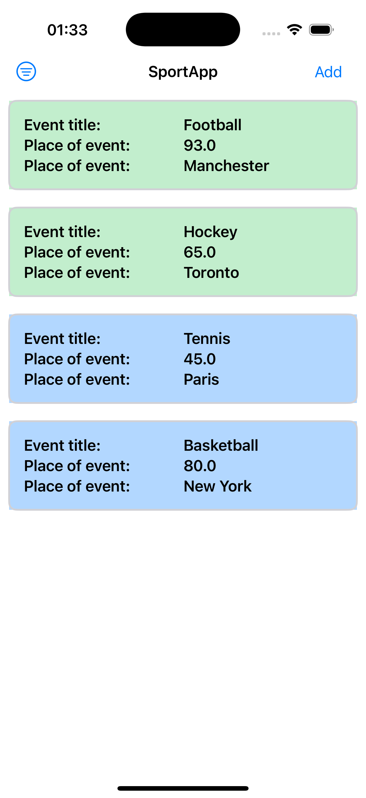
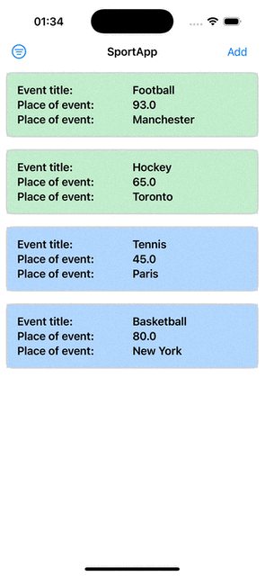

# Sport Records — README

A compact reference for the Test Assignment: a small SwiftUI app (no Storyboards/XIBs) that records sport results, stores them locally or remotely, and shows a filtered, colored list. This README explains what the project contains, why technologies were chosen, and how to get started quickly.

# What this app does (requirements)

- [x] Add a sport result: title, place, duration, choose storage (Local / Remote).

- [x] Save to local database (SwiftData) or remote backend (Firebase Firestore).

- [x] List saved results with filter (All | Local | Remote).

- [x] Rows are color-coded by storage type.

- [x] Works in both portrait and landscape.

# Tech & architecture — short rationale

- [x] SwiftUI — declarative UI, fast iteration, and native support for iOS modern layouts and rotations.

- [x] TCA (Composable Architecture) — predictable state, easy composition of features, and built-in testability for reducers/effects. Good fit for interview/test tasks to show structure and unit tests.

- [x] SwiftData (local) — Apple-first lightweight local persistence for simple domain models. Alternately you could use Realm if you prefer.

- [x] Firebase Firestore (remote) — simple hosted document store; wrapped behind a RemoteEventStore protocol so the app code stays decoupled. The Firestore adapter is implemented as a separate Swift Package so it can be swapped or isolated.

### Why this mix? It keeps the core app simple and testable while allowing a production-like remote implementation that is easy to replace or move into a package.
# Screenshot and video of application

  
  

